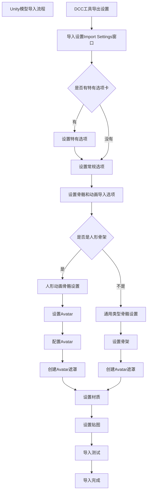

# 资源导入
**外部导入资源**：模型网格Mesh、纹理、音乐音效、字体、动画、视频等
**内部创建资源** :Prefab、Animation Controller、Timeline、RenderTexture、ParticleSystem、VFX等。

### QA
为什么使用Unity创建的资源还要涉及导入问题？
在不同平台上打开、使用第三方包等都会涉及导入
如何检测资源是否配置合理
使用 UPR AssetChecker 等工具 

# 音频
Q: **部分音频文件为什么要采用 Force To Mono**？
A:因为游戏采用的是双声道音频，有些音频左右声道的信息完全一样，所以可以采用该选项 改成单声道 进行优化
Q: **如何选取音频的压缩格式**？
A: 通常采用wav文件作为音频源文件，然后根据不同平台支持格式，对音频进行压缩处理，控制压缩比
多数音频采用Vorbis压缩格式进行压缩，如果音乐不打算循环，还可以采用mp3压缩格式进行压缩，某些平台对特定压缩格式有优化 如IOS的MP3。
也可以使用ADPCM压缩格式，这种格式压缩比虽然不够好，但是播放的解码速度很快
PCM格式为未压缩格式

我们还需要注意音频文件的采样率，如48khz无损采样率 这种对移动平台完全没有必要。
一般移动平台推荐设置为22050hz(22.05khz)，这是一个经验值

不同的 声音资源 推荐采用不同的加载类型，对应到音频导入的LoadType选项
- Decompress OnLoad 对应音频压缩后，大小小于200kb的文件
- Compressed in Memory 如果压缩后大小大于200kb，推荐采用
- Streaming 如果是类似背景音乐的 较长较大 的文件，推荐采用，通过流式加载，避免解析卡顿

==当游戏需要静音时，不要将声音设置为0，推荐将 AudioSource 移除，将其从内存中完全卸载。==

# 模型

尽可能使用DCC工具导出FBX格式作为导入链，DCC中还需要优化原始文件。
## 优化原始导入模型文件，删除不需要的数据
- 统一单位
- 导出的网格必须是多边形拓扑，不能是贝塞尔曲线、样条曲线、细分曲面、NURBS、NURMS等
- 在导出之前确保所有Deformers都烘培到网格模型上，如骨骼的形变烘焙到蒙皮权重上
- 不建议模型使用的纹理随模型导出
- 如果需要导入Blend shape normals时，必须指定光滑组Smooth groups
- 建议==导出时不携带如摄像机、灯光、材质等场景信息==

## 原始模型影响性能点
- 最小化面数，不需要微三角形面，三角面尽量分布均匀
- 合理的拓扑结构与平滑组，尽可能是闭包
- 尽量少的材质个数
- ==尽可能少的蒙皮网格==
- ==尽可能少的骨骼数量==，数量过多会引起CPU或GPU瓶颈
- FK节点与IK节点分离，导出时删除IK骨骼节点，Unity不支持导入的IK骨骼，做好分离，方便导出时删除IK节点

在Unity编辑器中要多角度进行模型进行观察，避免模型有微三角形面

继续【《Unity性能优化》第贰节——静态资源优化(2)——Model导入设置检查与优化】 【精准空降到 07:14】 https://www.bilibili.com/video/BV1VZ4y1Z7qm/?share_source=copy_web&vd_source=05da026b7dc230f4f358b96808ee390b&t=434
## Model 设置

**Meshes**

| 属性名           |                                                                                    |
| ------------- | ---------------------------------------------------------------------------------- |
| Mesh Compress |                                                                                    |
| Read/Write    | 启用此选项会在内存中额外启用一份子网格，一个副本保存在内存中，另一个在显存中。只有在运行中需要动态更改网格数据的时候 开启。SkinMesh 也需要开启此选项做动画 |
| IndexFormat   | 如果网格顶点数不超过 65535 可以开启16bit格式                                                       |

项目中的模型不需要动画数据的时候也可以关掉

ProjectSetting》Player〉Vertex Compression 
设置每个通道的顶点压缩，对除了位置、光照贴图、UV之外所有内容启用压缩
Optimize Mesh Data 可根据网格使用材质，删除不需要的数据，如不需要的 切线、法线、颜色、UV等

一些模型也可以将 Material 下的Material Creation Mode 设置为 None

# 纹理

## Unity 纹理基础概念
应用于模型表面增加细节的位图图像。一个3d模型下会拥有一张或多张纹理。纹理需要通过 shader和材质映射 才能到模型表面
可以运行时动态生成。
## 纹理类型
- Default：默认的纹理类型格式
- Normalmap：法线贴图，可将颜色通道转换为适合实时法线贴图格式
- Editor GUIandLegacy GUl：在编辑器GUl控件上使用纹理请选择此类型
- Sprite(2DandUI）：在2D游戏中使用的精灵(Sprite)或UGUI使用的纹理请选择此类型
- Cursor：鼠标光标自定义纹理类型
- Cookie：用于光照Cookie剪影类型的纹理
- Lightmap：光照贴图类型的纹理，编码格式取决于不同的平台
- SingleChannel：如果原始图片文件只有一个通道，请选择此类型
## 纹理大小
==最好纹理的长宽是 2的幂次==
不符合此比例的纹理Unity在导入时，会强行设置为2的幂次方的纹理大小，这样会造成纹理的浪费
纹理流程，也有不为 2的幂次 导入的格式 NPOT

选择合适纹理大小应尽量遵循以下经验：
- 不同平台、不同硬件配置选择不同的纹理大小，Unity下可以采用bundle变体设置多套资源、通过Mipmap限制不同平台加载不同level层级的贴图。
- 根据纹理用途的不同选择不同的纹理加载方式，如流式纹理加载TextureStreaming、稀疏纹理SparseTexture、虚拟纹理VirtualTexture等方式。
- 不能让美术人员通过增加纹理大小的方式增加细节可以选择细节贴图DetailMap或增加高反差保留的方式。
在不降低视觉效果的情况下尽量减小贴图大小，最好的方式是纹理映射的每一个纹素的大小正好符合屏幕上显示像素的大小，如果纹理小了会造成欠采样，纹理显示模糊，如果**纹理大了会造成过采样，纹理显示噪点**。这一点做到完美很难保障，可以充分利用SceneView->DrawMode->Mipmap来查看在游戏摄像机视角下哪些纹理过采样，哪些纹理欠采样来调整纹理大小。

在预览窗口的 Mipmap模式下，红色部分是过采样，蓝色是欠采样。
可以通过**调整Mipmap层级**获得更好的纹理表现
## 纹理颜色空间
默认大多数图像处理工具都会使用sRGB颜色空间处理和导出纹理。但如果你的纹理不是用作颜色信息的话，那就不要使用sRGB空间，如金属度贴图、粗糙度贴图或者法线贴图等。一旦这些纹理使用sRGB空间会造成视觉表现错误。
## 纹理压缩
纹理压缩是指图像压缩算法，保持贴图视觉质量的同时，尽量减小纹理数据的大小。默认情况下我们的纹理原始格式采用PNG或TGA这类通用文件格式，但与专用图像格式相比他们访问和采样速度都比较慢，无法通用GPU硬件加速，同时纹理数据量大，占用内存较高。所以在渲染中我们采用一些硬件支持的纹理压缩格式，如ASTC、ETC、ETC2、DXT等。
一个合理的纹理压缩方式，可以极大优化内存空间占用开销
## 纹理图集
纹理图集是一系列小纹理图像的集合
### 优点
一是采用共同纹理图集的多个静态网格资源可以进行静态合批处理，减少DrawCall调用次数。
是纹理图集可以减少碎纹理过多，因为他们打包在一个图集里，通过压缩可以更有效的利用压缩，降低纹理的内存成本和冗余数据。
### 缺点
美术需要合理规划模型，并且要求模型有相同的材质着色器，或需要制作通道图去区分不同材质。制作和修改成本较高。
## 纹理过滤
将低采样纹理优化显示效果

如何去选择正确的纹理过滤方式，下节课介绍
## MipMap 纹理
逐级别减少分辨率来保存纹理副本，纹理的LOD层级

- 逐级减低分辨率来保存纹理副本。相当于生成了纹理LOD，渲染纹理时，将根据像素在屏幕中占据的纹理空间大小选择合适的Mipmap级别进行采样。
- 优点：
	GPU不需要在远距离上对对象进行全分辨率纹理采样，因此可以提高纹理采样性能。
	同时也解决了远距离下的过采样导致的噪点问题，提高的纹理渲染质量
- 缺点：
	由于Mipmap纹理要生成低分辨率副本，会造成额外的内存开销。

MipMaps是做 Hierarchy Z call 的前提条件
可以通过 Unity的 Mipmap Streaming 功能，限制设备只采用某个级别以下的纹理，进行不同设备的适配

## 纹理配置

### Texture Shape
- 2D 最常用的2D纹理，默认选项
- Cube 十般用于天空和与反射探针，默认支持Default、Normal、Single Channel几种类型纹理，可以通过Assets >Create>Legacy>Cubemap生成，也可以通过C#代码 Camera.RenderToCubemap在脚本中生成
- 2D Array 2D纹理数组，可以极大提到大量相同大小和格式的纹理访问效率，但需要特定平台支持，可以通过引擎Systemlnfo.supports2DArrayTextures 接口运行时查看是否支持
- 3D 通过纹理位图方式存储或传递一些3D结构化数据，一般用于体积仿真，如雾效、噪声、体积数据、距离场、动画数据等信息，可以外部导入，也可运行时程序化创建。****
### Alpha
- Alpha Source
	默认选择lnput Texture Alpha就好，如果确定不使用原图中的Alpha通道，可以选择None.另外From Gray Scale我们一般不会选用
- Alpha Is Transparency
	指定Alpha通道是否开启半透明，如果位图像素不关心是否要半透明可以不开启此选项。这样Alpha信息只需要占1bit。节省内存
- Ignore Png file gamma
	是否忽略png文件中的gamma属性，这个选项是否忽略取决于png文件中设置不同gamma属性导致的显示不正常，一般原图制作流程没有特殊设置，这个选项一般默认就好
### Adcanced
- Read/Write 开启此选项会使得纹理内存使用量增加一倍
	默认选择lnput Texture Alpha就好，如果确定不使用原图中的Alpha通道，可以选择None.另外From Gray Scale我们一般不会选用
- Streaming Mipmaps 默认
- Virtual Texture Only 默认
- Generate Mip Maps
	- 什么时候不需要生成MipMaps
		2D场景
		固定视角，摄像机无法缩放远近
	- Border Mip Maps 默认不开启，只有当纹理的是Light Cookies类型时，开启此选项来避免colors bleeding现象导致颜色渗透到较低级别的Mip Level纹理边缘上
	- Mip Map Filtering
		Box 最简单，随尺寸减小，Mipmap纹理变得平滑模糊
		Kaiser，避免平滑模糊的锐化过滤算法。
	- Mip Maps Preserve Coverage ，只有需要纹理在开启mipmap后也需要做Alpha Coverage时启。默认不开启。
	- Fadeout Mip Maps,纹理Mipmap随Mip层级淡化为灰色，一般不开启，只有在雾效较大时开启不影响视觉效果。
### 纹理平铺模式与纹理过滤
选择合适纹理过滤的最佳经验：（放到导入设置）
- 使用双线性过滤平衡性能和视觉质量
- 有选择地使用三线性过滤，因为与双线性过滤相比，它需要更多的内存带宽。
- 使用双线性和 2× 各向异性过滤，而不是三线性过滤和 1× 各向异性过滤，因为这样做不仅视觉效果更好，而且性能也更高
- 保持较低的各向异性级别。仅对关键游戏资源使用高于 2 的级别。

## 各平台的默认纹理压缩格式

| 平台                     | 颜色模型 | 无         | 正常质量（默认设置）                                                                  | 高质量                                                                         | 低质量（更高性能）                                                                   |
| ---------------------- | ---- | --------- | --------------------------------------------------------------------------- | --------------------------------------------------------------------------- | --------------------------------------------------------------------------- |
| Windows、Linux、macOS    | RGB  | RGB 24 位  | RGB Compressed DXT1                                                         | RGB(A) Compressed BC7                                                       | RGB Compressed DXT1                                                         |
|                        | RGBA | RGBA 32 位 | RGBA Compressed DXT5                                                        | RGB(A) Compressed BC7                                                       | RGBA Compressed DXT5                                                        |
|                        | HDR  | RGBA Half | RGB Compressed BC6H                                                         | RGB Compressed BC6H                                                         | RGB Compressed BC6H                                                         |
| WebGL                  | RGB  | RGB 24 位  | RGB Compressed DXT1                                                         | RGB Compressed DXT1                                                         | RGB Compressed DXT1                                                         |
|                        | RGBA | RGBA 32 位 | RGBA Compressed DXT5                                                        | RGBA Compressed DXT5                                                        | RGBA Compressed DXT5                                                        |
| Android (configurable) | RGB  | RGB 24 位  | RGBA Compressed ASTC 6x6 block RGB Compressed ETC2 RGB Compressed ETC | RGBA Compressed ASTC 4x4 block RGB Compressed ETC2 RGB Compressed ETC | RGBA Compressed ASTC 8x8 block RGB Compressed ETC2 RGB Compressed ETC |
|                        | RGBA | RGBA 32 位 | RGBA Compressed ASTC 6x6 block RGBA Compressed ETC2                      | RGBA Compressed ASTC 4x4 block RGBA Compressed ETC2                      | RGBA Compressed ASTC 8x8 block RGBA Compressed ETC2                      |
| iOS (configurable)     | RGB  | RGB 24 位  | RGBA Compressed ASTC 6x6 block RGB Compressed PVRTC 4 bits               | RGBA Compressed ASTC 4x4 block RGB Compressed PVRTC 4 bits               | RGBA Compressed ASTC 8x8 block RGB Compressed PVRTC 2 bits               |
|                        | RGBA | RGBA 32 位 | RGBA Compressed ASTC 6x6 block RGBA Compressed PVRTC 4 bits              | RGBA Compressed ASTC 4x4 block RGBA Compressed PVRTC 4 bits              | RGBA Compressed ASTC 8x8 block RGBA Compressed PVRTC 2 bits              |
| tvOS                   | RGB  | RGB 24 位  | RGBA Compressed ASTC 6x6 块                                                  | RGBA Compressed ASTC 4x4 块                                                  | RGBA Compressed ASTC 8x8 块                                                  |
|                        | RGBA | RGBA 32 位 | RGBA Compressed ASTC 6x6 块                                                  | RGBA Compressed ASTC 4x4 块                                                  | RGBA Compressed ASTC 8x8 块                                                  |
| Default                | RGBA | RGBA 32 位 | RGBA 16 位                                                                   | RGBA 16 位                                                                   | RGBA 16 位                                                                   |
## 注意
纹理图集利用率偏低，会造成内存浪费
如果 图集内的元素生命周期不一样，会造成 资源长期无法释放
==减少图集大小，并尽可能使用相近生命周期的 元素==
不合理的半透明UI纹理，会造成大量Overdraw开销
过多的 2d序列帧动画并未打成图集
大量重复纹理和不合理的通道图
只有颜色差异，但内容相似的UI贴图，可以采用分离变化区域贴图，同时采用UI的九宫格缩放
大量颜色渐变贴图 既不压缩，也不采用单像素宽度，这种情况贴图可以替换为曲线数据或采用单像素梯度纹理，减少贴图的内存开销和加载开销

# 动画
## 模型导入

### AnimationType
- None 无动画
- Legacy 旧版动画，不要用
- Generic 通用骨骼框架
- Humannoid 人形骨骼框架
#### 选择原则
- 无动画选择None
- 非人形动画选择Generic
- 人形动画
	人形动画需要Kinematices或AnimationRetargeting功能，或者有自定义骨骼对象时选择Humanoid Rig
	其他都选择Generic Rig，在骨骼数差不多的情况下,Generic Rig会比Humanoid Rig节省30%甚至更多的CPU的时间。节省的开销是因为 Generic不用Kinematics和AnimationRetargeting的这部分
### 其他
- Skin Weights
	默认4根骨头，单对于一些不重要的动画对象可以减少到1根，节省计算量
- Optimize Bones
	建议开启，在导入时自动剔除没有蒙皮顶点的骨骼
	在Unity Quality中也可以对高中低选项做不同设置
- Optimize Game Objects
	在Avatar和Animatior组件中删除导入游戏角色对象的变换层级结构，而使用Unity动画内部结构骨骼，消减骨骼transform带来的性能开销
	可以提高动画角色性能，但有些情况下会造成角色动画错误，这个选项可以尝试开启但要看表现效果而定。注意如果你的角色是可以换装的，在导入时不要开启此选项，但在换装后在运行时代码中通过调用
	AnimatorUtility.OptimizeTransformHierarchy接口仍然可以达到此选项效果。
## 动画导入

- Resample Curves
	将动画曲线重新采样为四元数值，并为动画每帧生成一个新的四元数关键帧，仅当导入动画文件包含欧拉曲线时才会显示此选项
- Anim. Compression
	Off 不压缩，质量最高，内存消耗最大
	Keyframe Reduction 减少冗余关键帧，减小动画文件大小和内存大小
	Keyframe Reduction and Compression减小关键帧的同时对关键帧存储数据进行压缩，只影响文件大小
	这些Error默认是0.5，认为是 transition在千分之五的区间内都可以认为是两帧数据一致，从而使用Keyframe Reduction减少冗余关键帧。如果需要更多细节，可以减少该数值
	Optimal 仅适用于Generic与Humanoid动画类型，Unity决定如何进行压缩
- Animation Custom Properties
	导入用户自定义属性，一般对应DCC工具中的extraUserProperties字段中定义的数据
## 动画曲线信息
 
Curves Pos:位置曲线
Quaternion:四元数曲线 Resample Curves开启会有
Euler:欧拉曲线
Scale:缩放曲线
Muscles:肌肉曲线，Humanoid类型下会有
Generic：一般属性动画曲线，如颜色，材质等
PPtr：精灵动画曲线，一般2D系统下会有
Curves Total:曲线总数
Constant:优化为常数的曲线
Dense：使用了密集数据（线性插值后的离散值）存储
Stream：使用了流式数据（插值的时间和切线数据）存储
## 动画文件导入设置优化后信息查着原则
- 一看效果差异（与原始制作动画差异是否明显）
- 二看曲线数量（总曲线数量与各种曲线数显，常量曲线比重大更好）
- 三看动画文件大小（动画文件在小几百k或更少合理，查过1M以上的动画文件考虑是否合理)
## QA
Q: **曲线多的情况如何优化**
A: 修改error范围，在不影响视觉效果的前提下让常量曲线占比尽可能高
